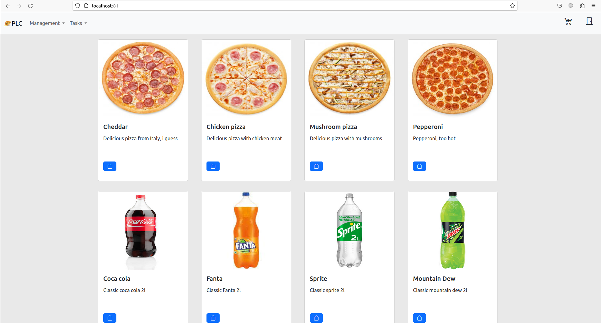

## Description
<h4>Pizza lovers club - это веб приложения для формирования, создания и отслеживания заказов онлайн.</h4>
На момент 05.10.2023 приложение предназначено только для одной точки, а не торговой сети.

## Requirements
1) For Linux: GIT, Docker, 2 GB free space
2) For Windows: GIT, WSL2.0, Docker, 2 GB free space

## Installation
1) Открыть терминал, перейти в директорию для проекта.
2) Выполнить команду git clone https://github.com/Dicluu/Pizza_Lovers_Club.git
3) Перейти в директорию pizza-club/scripts
   

For Linux:

4) Выполнить команду: bash deploy.sh
   
   **При первой попытке, развертывание проекта может занять до 20 минут
5) Выполнить команду: bash start.sh или start (seeding).sh (В случае, если желаете установить базовые лоты и аккаунты в сервисе). 
   
For Windows:

4) Открыть файл deploy.bat

    **При первой попытке, развертывание проекта может занять до 20 минут
5) Открыть файл start.bat или start (seeding).bat (В случае, если желаете установить базовые лоты и аккаунты в сервисе).

6) Остановить приложение можно выполнив скрипт down.sh или down.bat

При удачном развертывании проекта он должен быть доступен по адрессу localhost:81
Вся документация по использованию находится в директории docs

